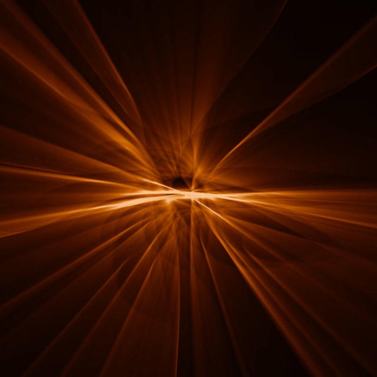

Community Wallpapers
=====================

Collection of wallpapers, selected and pushed here by community members.

### Add new wallpapers and push them to a watch
- Place jpg, jpeg, png, svg, bmp or webp images of at least 480x480px resolution into the document root.
- Use the `./generate-scaled-images.sh` script to generate preview images.
- Copy all wallpapers and preview images to a watch connected via USB/SDK Mode using the `./copy-to-watch.sh` script.
- For advanced copy options execute `./copy-to-watch.sh -h`.

### PR your wallpaper to this community repo
- Fork and clone this repo.
- Add one wallpaper and its previews in a new local branch
- Push to your fork and PR to this repo

If you need help with the process, join our matrix channel for support chat.

### Stock integration of new wallpapers
The stock wallpapers located in the [asteroid-wallpapers](https://github.com/AsteroidOS/asteroid-wallpapers) repo have been curated by a community voting.
If you think your wallpaper fits the general AsteroidOS style and would be a good addition to the stock wallpapers. Please request in your PR comment for stock integration. The AsteroidOS team will either discuss your entry individually. Or que it for the next upcomming community voting.

| Image | Creator | Title | Source | License |
|---|---|---|---|---|
|  | 4510waza | Tea leaf　八十八夜 | [flickr](https://www.flickr.com/photos/4510waza/2455787369/) | CC BY 2.0 |
|  |  |  |  |  |
|  |  |  |  |  |
|  |  |  |  |  |
|  | bm.iphone | texture | [flickr](https://flic.kr/p/afKDZw) | CC BY 2.0 |
|  | Brett Jordan | Saturated Sands | [flickr](https://flic.kr/p/czdQr9) | CC BY 2.0 |
|  |  |  |  |  |
|  |  |  |  |  |
|  |  |  |  |  |
|  |  |  |  |  |
|  | Engin_Akyurt | Holz Baum Textur Abstrakt Motiv Detailaufnahmen | [pixabay](https://pixabay.com/de/holz-baum-textur-abstrakt-motiv-3052032/) |  CC0 1.0 |
|  | Engin_Akyurt | Holz-Faserplatten Baum Boden Muster Holz Braun | [pixabay](https://pixabay.com/de/holz-faserplatten-baum-boden-muster-3219590/) |  CC0 1.0 |
|  | Contains modified Copernicus Sentinel data (2015–16) / ESA SEOM INSARAP study / PPO.labs / Norut / NGU | Bay Area Displacement | [ESA](http://www.esa.int/Applications/Observing_the_Earth/Copernicus/Sentinel-1/Satellites_confirm_sinking_of_San_Francisco_tower) | CC BY-SA 3.0 IGO |
|  | contains modified Copernicus Sentinel data (2019), processed by ESA | Bering in dire straits | [ESA](https://www.esa.int/ESA_Multimedia/Images/2019/03/Bering_in_dire_straits) | CC BY-SA 3.0 IGO |
|  | Copernicus Sentinel data (2018), processed by ESA | Meeting of waters | [ESA](https://www.esa.int/ESA_Multimedia/Images/2019/09/Meeting_of_waters) | CC BY-SA 3.0 IGO |
|  |  |  |  |  |
|  |  |  |  |  |
|  |  |  |  |  |
|  |  |  |  |  |
|  |  |  |  |  |
|  |  |  |  |  |
|  | Jan Beck | Schauinsland im Winter | [flickr](https://flic.kr/p/cWLkjN) | CC BY 2.0 |
|  |  |  |  |  |
|  | JRT | Fluid Lilac |[jrtberlin.de](https://dl.jrtberlin.de/wallpapers/fluid_lilac/) | CC BY-SA 3.0 IGO |
|  | JRT | Yellow Asteroid Canyon |[jrtberlin.de](https://dl.jrtberlin.de/wallpapers/yellow_asteroid_canyon.jpg) | CC BY-SA 3.0 IGO |
|  |  |  |  |  |
|  |  |  |  |  |
|  | Kevin Dooley | Lake Michigan serenity | [flickr](https://www.flickr.com/photos/pagedooley/3869914397/) | CC BY 2.0 |
|  | Kevin Dooley | Milion dollar sunsets 2013 | [flickr](https://www.flickr.com/photos/pagedooley/9736485307/) | CC BY 2.0 |
|  | kinkate | Mädchen Schaukelt Skyline Wolkenkratzer Downtown | [pixabay](https://pixabay.com/photo-2067378/) |  CC0 1.0 |
|  |  |  |  |  |
|  | mikefoster | String Bass Gitarre Musik Stein Ton Instrument | [pixabay](https://pixabay.com/de/string-bass-gitarre-musik-stein-555070/) |  CC0 1.0 |
|  | Joe deSousa | Greek Sunrise on the Ionian Sea | [flickr](https://flic.kr/p/JQm1of) | CC0 1.0 |
|  |  |  |  |  |
|  | Pexels | Verschwommen Bokeh Bunte Beleuchtung | [pexels](https://pixabay.com/photo-1834820/) | CC0 1.0 |
|  |  |  |  |  |
|  | Reinhard Link | New York: Empire State Building & skyscrapers in sunset light | [flickr](https://flic.kr/p/PLzLnX) | CC BY-NC-SA 2.0 |
|  | Ryan McGinty | abend abstrakt berg dammerung | [pexels](https://www.pexels.com/de/foto/abend-abstrakt-berg-dammerung-361726/) | CC0 1.0 |
|  | simon.hedge | Ipswich is THAT way | [flickr](https://www.flickr.com/photos/shedge/5447882622/) | CC BY 2.0 |
|  | Thomas Leuthard | Jökulsárlón, Iceland | [flickr](https://www.flickr.com/photos/thomasleuthard/18155790692/) |  |  | I think it's a good lighttrail | CC BY 2.0 |
|  | Thomas Leuthard | Lisboa #24 | [flickr](https://www.flickr.com/photos/thomasleuthard/9240057900/) | CC BY 2.0 |
|  | weisanjiang | City Skyline Stadtansicht Gebäude Sonnenuntergang | [pexels](https://pixabay.com/photo-3024616/) | CC0 1.0 |
|  |  |  |  |  |
